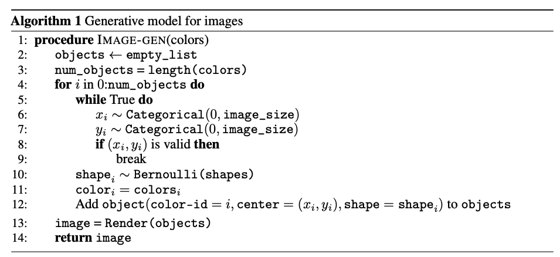
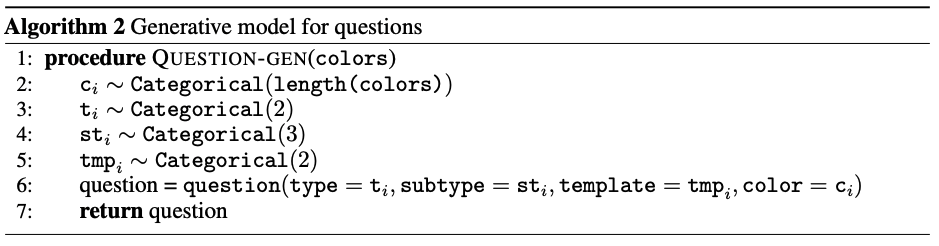

# Bayesian Visual Question Answering

Reproducing results from Singh et. al [https://www.cs.ubc.ca/~saeidnp/files/reports/vqa-bayesian.pdf](https://www.cs.ubc.ca/~saeidnp/files/reports/vqa-bayesian.pdf). This is a visual question answering system in a fully Bayesian setting where vision and language have been disentangled into seperate inference problems. From an observed image, the image latents are inferred, and from an observed question, the question latents are observed. Then, a symbolic sovler uses the image latents and question latents to provide an answer to the question. The images and questions are from the sort-of-clevr dataset. 

Explaination of the sort-of-clevr dataset is found [here](https://github.com/kimhc6028/relational-networks#:~:text=Sort%2Dof%2DCLEVR%20is%20simplified,and%20placed%20in%20a%20image.), we use the [sort_clevr_generator.py](https://github.com/kimhc6028/relational-networks/blob/master/sort_of_clevr_generator.py) file from [kimhc6028's implementation of the relational networks](https://github.com/kimhc6028/relational-networks) to construct the dataset and to define the generative models. 

The generative model for images is described below by Singh et. al and implemented by us in [ImageGenerator.ipynb](ImageGenerator.ipynb)

The generative model for questions is described below by Singh et. al and implemented by us in [QuestionGenerator.ipynb](QuestionGenerator.ipynb)
  
  
The symbolic solver is implemented by us in [SymbolicSolver.ipynb](SymbolicSolver.ipynb). 
 
More information can be found in our [report](report.pdf) about our experiments and findings. 
  
